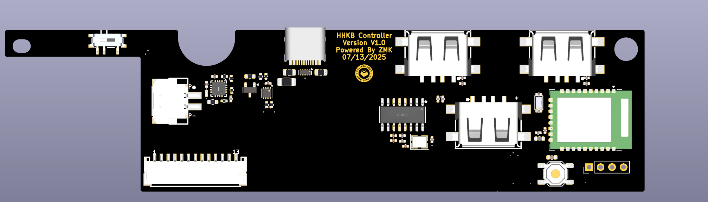

# KUSH HHKB Pro 2 with ZMK firmware &  embeded MCU E73-2G4M08S1C (Nrf52840)
 The firmware is based on Kanru's HHKB firmware while the PCB is designed based on Ebastler's zmk design guide.  
 Firmware will be opensourced here as reference, while the schematic and PCB design will not be open sourced.   
 However, based on the design guide, you can reverse engineer the pcb.  
 Chip selection of E73-2G4M08S1C because of the wide availability and ease of SMT assembly. You can opt in for the antenna version if you wish.   

This project provides an out-of-tree Zephyr module and shield definition  
for the HHKB Pro2 daugther board.  

The `hhkb_pro2` shield defines the default HHKB keymap and `zmk,kscan`
chosen. Any board can use the `hhkb_pro2` shield by defining the

## Source and credits
[Kanru's HHKB zmk firmware](https://github.com/kanru/hhkb-zmk)  
Firmware is modified based on Kanru's  
[Ebastler's zmk design guide](https://github.com/ebastler/zmk-designguide?tab=readme-ov-file#Vsense)  
Based on the guide, I used DCDC HV Input along with advanced Vsense based on MAX17048 chip  
[Config for DCDC HV Input to allow vdd at 3.3v](https://devzone.nordicsemi.com/f/nordic-q-a/84089/nrf52840-dongle-set-regout0-for-3v3-vdd-out)  
Changing the Regout0 to bump the voltage to 3.3v  

Special thanks to Deepseek/ChatGPT for helping me understand better on the code

## Functionality
Exactly the same as you expect on a bluetooth controller. Switching between wireless and wired, up to 5 profiles by default  
SL2.1A Expansion chip allow wired connection to 3 more (2 external, 1 internal) USB Devices. Do not this is running USB2.0 Full Speed, so only connect it with non-power hungry USB Devices.  
Under wireless mode, the hub become disabled and will not work like Bluetooth-Hub. Only the keyboard part will function normally.   

## What is the difference from Kanru's firmware
Since Kanru's firmware is based on nice_nano_v2, the chip will be different.   
Alongside, since E73 will be using DCDC HV Input, you will have to config it in the board.c and Kconfig file to bump the voltage from default 1.8V to 3.3V. Otherwise it does not supply enough voltage for the main hhkb controller board to run.  
Otherthan those, there are not much difference.   

## Hardware availability
[Keyspensory](keyspensory.store)
Will be running open gb/pre order, along with Hannn's pro2k pro2 aftermarket case  
[Keyspensory Discord](https://discord.gg/GE89KjMGkm)

I used XH 2.54 connector, so you will have to prepare your own 3.7V battery pouch. The Battery Pin is labeled on the PCB  

## Notes on design
Please consider raised [USB C Connector](https://item.szlcsc.com/26898554.html?spm=sc.ols.it0-1___sc.ct.hd.dd&lcsc_vid=QFFaAlJVQVFXVF1fTgNfUAcEFFVdUVRRQgRcXlBREVExVlNTRVJaU1FTRVFWVjtW)  
This USB Connector raised the USB C at 1mm. Will be fitting better to pre-modified HHKB Pro 2 Case.  

## Render of the final product


## Build locally

Follow the steps in the [official ZMK document](https://zmk.dev/docs/user-setup) to setup build environment.

Setup Zephyr

```sh
west init -l config
west update
```

to build KUSH HHKB Pro 2:

```sh
west build -s zmk/app -p -b e73_pro2 -- \
    -DSHIELD=hhkb_pro2 \
    -DZMK_CONFIG=$PWD/config
``` 

The finished UF2 file is at `build/zephyr/zmk.uf2`

to flash, just drag and dropped the corresponding uf2 (should be named after e73_pro2) to the uf2 drive and good to go

If you have any questions, feel free to open issues and discuss